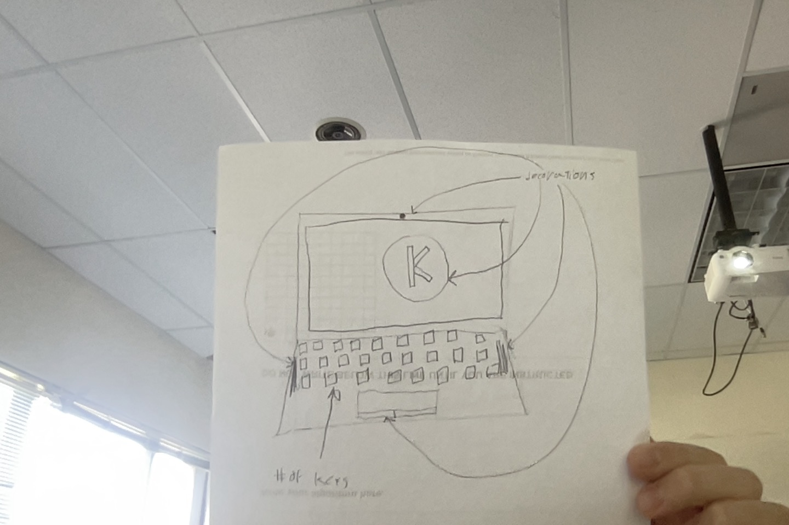

# Project Proposal

1. Roughly, what will your drawing look like

I will draw a laptop

2. What are two variables you could use so that when you change each variable, the drawing changes?

I can use a variable for speed
I can use a variable for the screen border size
I will use a function and var to ask which decorations to include

3. Where is there repetition in your drawing?

The keys

4. What are the main parts of your drawing? Are there clear sections or objects?

Screen border & screen
Bottom part of laptop: trackpad & keys

5. How could you use a loop variable of a for loop? Is there somewhere in your drawing where something is repeated, but it's slightly different each time? Maybe the same object is repeated in different places, or maybe a similar object is repeated but with different sizes?

I will use a loop variable for the shape keys
I will use a loop variable for the spacing of the keys

6. Functions

I will use a function for each row of keys that
I will use a function for laptop decoration
